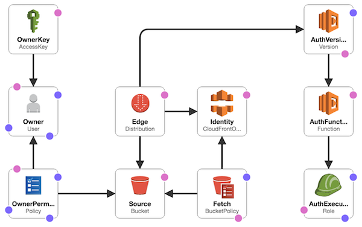

# WebApp for AWS

**WebApp for AWS** is a CloudFormation template to help setting up the infrastructure needed for a typical Single Page Application (SPA) based on AWS services.



The following AWS services are used:
* [IAM](https://aws.amazon.com/iam/)
* [S3](https://aws.amazon.com/s3/)
* [CloudFront](https://aws.amazon.com/cloudfront/)
* [Lambda](https://aws.amazon.com/lambda/)

## Getting started

To quickly create a stack with the latest version click on the button below.

[](https://console.aws.amazon.com/cloudformation/home?region=us-east-1#/stacks/new?templateURL=https://s3.amazonaws.com/supercharge-templates/webapp/latest/webapp.template)

---

# Contents

* [Parameters](#parameters)
* [Outputs](#outputs)
* [Authors](#authors)
* [License](#license)

# Outputs

| name | description|
|-|-|
| `AccessKeyId` | IAM access key of bucket owner |
| `AccessKeySecret` | IAM key secret of bucket owner |
| `BucketName` | Name of S3 bucket |
| `DistributionId` | ID of the CloudFront distribution |
| `DistributionDomain` | Domain name for the CloudFront the distribution |

# Authors

[redcancode](https://github.com/redcancode) & [exoszajzbuk](https://github.com/exoszajzbuk) @ [](http://supercharge.io/)

# License

[MIT](LICENSE.md)

```
Copyright (c) 2018 Supercharge

MIT License

Permission is hereby granted, free of charge, to any person obtaining
a copy of this software and associated documentation files (the
"Software"), to deal in the Software without restriction, including
without limitation the rights to use, copy, modify, merge, publish,
distribute, sublicense, and/or sell copies of the Software, and to
permit persons to whom the Software is furnished to do so, subject to
the following conditions:

The above copyright notice and this permission notice shall be
included in all copies or substantial portions of the Software.

THE SOFTWARE IS PROVIDED "AS IS", WITHOUT WARRANTY OF ANY KIND,
EXPRESS OR IMPLIED, INCLUDING BUT NOT LIMITED TO THE WARRANTIES OF
MERCHANTABILITY, FITNESS FOR A PARTICULAR PURPOSE AND
NONINFRINGEMENT. IN NO EVENT SHALL THE AUTHORS OR COPYRIGHT HOLDERS BE
LIABLE FOR ANY CLAIM, DAMAGES OR OTHER LIABILITY, WHETHER IN AN ACTION
OF CONTRACT, TORT OR OTHERWISE, ARISING FROM, OUT OF OR IN CONNECTION
WITH THE SOFTWARE OR THE USE OR OTHER DEALINGS IN THE SOFTWARE.
```
